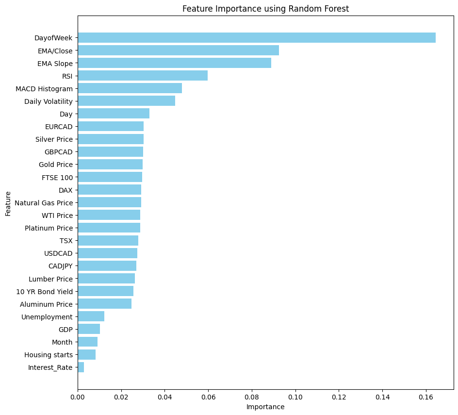
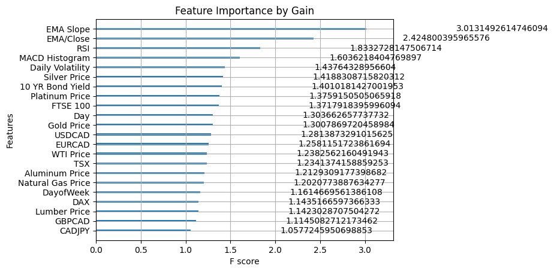

# Lighthouse Labs - Data Science Final Project 

Created by: Ken Wall

### Data Science Final Project - Stock Price Prediction

To determine if the TSX index price will go up/down the next day based on a wide range of financial and economic features.

## Project Goals

To apply supervised learning techniques to a real-world financial data set and use exploratory data analysis, dimensionality reduction and feature engineering to communicate the insights gained from the analysis. To gain insights from the data sets and communicate these insights to stakeholders using appropriate visualizations and metrics to make informed decisions based on the business questions asked.

## Process

### <u>Part 1: Obtaining the Dataset</u>

Obtaining the financial and economic information was not challenging but tedious, because every feature had to be obtained in its own CSV file and then combined later on in Python.

Information could be broken down into the following categories:

- Commodities
- Currencies
- Economic
- Indexes

The individual commodity, currency and index information could be found on Investing.com. The economic data was taken from Statistics Canada. The economic data was not in a usuable format so custom Python functions had to be created to format it properly. Categories were first combined and then merged into a preprocessed dataset to be used in the baseline and the iterations of model selection.

### <u>Part 2: Exploratory Data Analysis (EDA)</u>

**BASELINE** - Time and careful consideration was given to the selection of the original features, so no EDA was done for baseline. The preprocessed dataset was cross validated using TimeSeriesSplit and then sent for model selection. See model selection below for further details.

**DATE-TIME COMPONENTS** - No meaningful patterns or trends were identified when reviewing if the index prices were up/down in certain years, months, and days. The index increased slightly more on a daily basis than going down at an average of 52.4% of the time. The maximum month where the index went up was 82.6% of the time in 2019 and the minimum was 2017 September at 27%. During the Covid Pandemic the market actually performed better in 2019-2021 with the index increasing greater than 55% of the time. Monthly fluctions occured, but on average each year the results are 
similar across all 10 years.

**TIME-SERIES GRAPHING** - When reviewing the line graphs over the 10 year time horizon of all the features it can be seen that many of the features have the same pattern/trend. A sharp decrease during COVID and a steady rise after. It is likely that the correlation between these features is very high, which will be confirmed in the next test.

**ITERATION 8 - CORRELATION** - After running the correlation matrix and heatmap, there are 11 features that have a correlation of greater than 0.9 with each other. Highly correlated features can lead to model problems due to multicolinearity and redundant information. As part of the iterative process, iteration 8 will remove the features with correlation greater than 0.9 and see how the model performs.

Removing the correlated features significantly improved the F1 Score from the Baseline of 0.62 to 0.65. I will keep the correlated features for the remainder of the iterations and test again in Version 14 with all the other engineered features added. As can be seen from the results removing the correlated features from Version 13 to Version 14 improved the F1 Score by another 0.01 from 0.72 to 0.73 achieving the highest F1 Score.

### <u>Part 3: Model Selection</u>

I chose an iterative approach to model selection and ran the dataset through the following models during each iteration to determine which had the best results:

- Logistic Regression
- Random Forest Classifier
- Support Vector Machines
- k-Nearest Neighbors (k-NN)
- XGBoost
- Neural Networks (MLP)

The table below outlines the changes made during each iteration and the model that had the best F1 Score. I chose the model with the highest F1 score to balance both precision (how many of the predicted positives are actually true positives) and recall (how many of the actual positives were correctly predicted).

 <table>
  <tr>
    <th>Version</th>
    <th>Iteration Changes</th>
    <th>Best Model</th>
    <th>F1 Score</th>
    <th>Accuracy</th>
  </tr>
  <tr>
    <td>Baseline</td>
    <td>Baseline</td>
    <td>XGBoost</td>
    <td>0.62</td>
    <td>0.53</td>
  </tr>
   <tr>
    <td>Version 1</td>
    <td>Baseline + EMA</td>
    <td>k-Nearest Neighbors</td>
    <td>0.62</td>
    <td>0.51</td>
  </tr>
   <tr>
    <td>Version 2</td>
    <td>Baseline + EMA + EMA Slope</td>
    <td>k-Nearest Neighbors</td>
    <td>0.64</td>
    <td>0.56</td>
  </tr>
   <tr>
    <td>Version 3</td>
    <td>Baseline + EMA + EMA Slope + EMA/Close</td>
    <td>Support Vector Machines</td>
    <td>0.68</td>
    <td>0.56</td>
  </tr>
   <tr>
    <td>Version 4</td>
    <td>Baseline + EMA + EMA Slope + EMA/Close + EMA Divergence</td>
    <td>k-Nearest Neighbors</td>
    <td>0.66</td>
    <td>0.61</td>
  </tr>
   <tr>
    <td>Version 5</td>
    <td>Baseline + EMA + EMA Slope + EMA Divergence</td>
    <td>k-Nearest Neighbors</td>
    <td>0.65</td>
    <td>0.59</td>
  </tr>
   <tr>
    <td>Version 6</td>
    <td>Baseline + RSI</td>
    <td>k-Nearest Neighbors</td>
    <td>0.61</td>
    <td>0.53</td>
  </tr>
  <tr>
    <td>Version 7</td>
    <td>Baseline + Volatility</td>
    <td>XGBoost</td>
    <td>0.65</td>
    <td>0.61</td>
  </tr>
  <tr>
    <td>Version 8</td>
    <td>Baseline - Correlation</td>
    <td>k-Nearest Neighbors</td>
    <td>0.65</td>
    <td>0.53</td>
  </tr>
  <tr>
    <td>Version 9</td>
    <td>Baseline + MACD</td>
    <td>k-Nearest Neighbors</td>
    <td>0.62</td>
    <td>0.52</td>
  </tr>
  <tr>
    <td>Version 10</td>
    <td>Baseline + EMA + EMA Slope + EMA/Close + RSI</td>
    <td>XGBoost</td>
    <td>0.64</td>
    <td>0.64</td>
  </tr>
  <tr>
    <td>Version 11</td>
    <td>Baseline + EMA + EMA Slope + EMA/Close + Volatility</td>
    <td>Support Vector Machines</td>
    <td>0.69</td>
    <td>0.54</td>
  </tr>
  <tr>
    <td>Version 12</td>
    <td>Baseline + EMA + EMA Slope + EMA/Close + MACD</td>
    <td>Logistic Regression</td>
    <td>0.70</td>
    <td>0.57</td>
  </tr>
  <tr>
    <td>Version 13</td>
    <td>Baseline + All EMA Features + RSI + MACD + Volatility</td>
    <td>Logistic Regression</td>
    <td>0.72</td>
    <td>0.63</td>
  </tr>
    <tr>
    <td>Version 14</td>
    <td>Baseline - Correlation + All EMA Features + RSI + MACD + Volatility</td>
    <td>Logistic Regression</td>
    <td>0.73</td>
    <td>0.65</td>
  </tr>
</table> 

After several versions of trial and error for features engineered for time based features (exponential moving average EMA), price transformations (volatility) and technical indicators (relative strength index RSI and moving average convergence divergence MACD) I moved to model driven feature elimination using recursive feature elimination (RFE) and Random Forest Importance to see if I can improve the model above the current benchmark of 0.73 F1 Score set in the Version 14 Logistic Regresssion Model. I have included all features initially to test this, baseline - correlation + all EMA features, RSI, MACD and volatility.

#### Recursive Feature Elimination

##### <u>Logistic Regression</u>
Logistic Regression was the most successful model for the 14 iterations noted above in version 14 with an F1 Score of 0.73, so I selected it for testing again for RFE. The RFE class requires a number of features and I selected a range from 17 to 25 features given that the total number of features are 28. The F1 Score results are listed below. 20 features had the highest F1 Score at 0.656.

 <table>
  <tr>
    <th>Number of Features</th>
    <th>F1 Score</th>
  </tr>
  <tr>
    <th>17</th>
    <th>0.644</th>
  </tr>
  <tr>
    <th>20</th>
    <th>0.656</th>
  </tr>
  <tr>
    <th>25</th>
    <th>0.636</th>
  </tr>
</table>

##### <u>XGBoost</u>
XGBoost was the second most successful model for the 14 iterations noted above, so I selected it for testing again for RFE. The RFE class requires a number of features and I selected a range from 17 to 25 features given that the total number of features are 28. The F1 Score results are listed below. 20 features had the highest F1 Score at 0.713.

 <table>
  <tr>
    <th>Number of Features</th>
    <th>F1 Score</th>
  </tr>
  <tr>
    <th>17</th>
    <th>0.708</th>
  </tr>
  <tr>
    <th>20</th>
    <th>0.713</th>
  </tr>
  <tr>
    <th>25</th>
    <th>0.684</th>
  </tr>
</table>

#### Feature Importance

##### <u>Random Forest</u>

I also wanted to rank the importance of the features using the random forest classifier, which can be seen in the image below. There are 5 features (Unemployment to Interest Rate) that have minimal importance to the model. I dropped those features and then ran the data set through all of the models again and Random Forest had an F1 Score of 0.71 and an Accuracy of 0.66.

##### <u>XGBoost</u>

 I also did feature importance with XGBoost, but the less important of features weren't as obvious. I chose an arbitrary cutoff value of a feature importance by gain of 1.2, which was items less than Natural Gas Prices and removed those features and ran it through all the models again with the updated features. This resulted in an F1 Score of 0.74 on the Logistic Regression model, the highest value so far.

An F1 Score of 0.74 done through Logistic Regression's model using feature elimination from XGBoost, which is now the current benchmark and hyperparameter tuning is the next step to see if I can improve the F1 Score of the model further.

### <u>Part 4: Hyperparameter Tuning</u>

There was some overfitting with XGBoost between the train and test set. The F1 Score was 1 for the train set and the F1 Score for the test set was 0.68, which is a large difference and a good indication of overfitting model. I tried to set some of the parameters to help with the overfitting, the results can be found below.

##### <u>XGBoost</u>

Using the XGBClassifier I used GridSearchCV to determine the best paramaters and F1 Score, which was improved from 0.68 to 0.69. The train set had a F1 score of 0.73, so the model performed better and overfitting was not an issue.

<table>
<tr><th>Best parameters found</th><tr>
<tr>
  <th>n_estimators</th>
  <th>200</th>
</tr>
<tr>
  <th>learning_rate</th>
  <th>0.01</th>
</tr>
<tr>
  <th>max_depth</th>
  <th>3</th>
</tr>
<tr>
  <th>min_child_weight</th>
  <th>5</th>
</tr>
<tr>
  <th>gamma</th>
  <th>0.1</th>
</tr>
<tr>
  <th>subsample</th>
  <th>0.8</th>
</tr>
<tr>
  <th>colsample_bytree</th>
  <th>0.8</th>
</tr>
<tr>
  <th>reg_alpha</th>
  <th>0.1</th>
</tr>
<tr>
  <th>reg_lamda</th>
  <th>1.0</th>
</tr>
</table>

##### <u>Logistic Regression</u>

Using the Logistic Regression class, I used GridSearchCV to determine the best paramaters and F1 Score, which stayed constant at an F1 Score of 0.73.

<table>
<tr><th>Best parameters found</th><tr>
<tr>
  <th>C - Regularization</th>
  <th>0.1</th>
</tr>
<tr>
  <th>Penalty</th>
  <th>L2</th>
</tr>
<tr>
  <th>Solver</th>
  <th>newton-cg</th>
</tr>
<tr>
  <th>Max Iterations</th>
  <th>1000</th>
</tr>
</table>

### <u>Part 5: Back Testing</u>

An F1 Score of 0.73 was promising so I decided to back test the model's predictions using the test data set to see how well it would perform. I started with a investment seed value of $1M given that the TSX index is trading greater than $20,000. I used the two best performing models to test.

I tried two different simple trading strategies as I am not a professional trader:

1. Dollar Cost Averaging - if the model predicts the price will go down, buy one share. Sell the next day if price is higher.
2. Invest All - invest all the money at the open price if the model predicts the price will go up. If the close price is higher that day, sell, if not hold to another day till the price is higher.

#### <u>1. Dollar Cost Averaging</u>

#### XGBoost

The cummulative investment gains were $113,794 after $10 trading commission fees. This translated to a total gain of 11.38% and an annualized gain of 4.19%.

#### Logistic Regression

The cummulative investment gains were $129,312 after $10 trading commission fees. This translated to a total gain of 12.93% and an annualized gain of 4.74%.

#### <u>2. Investing All Up Front</u>

#### XGBoost

The cummulative investment gains were $634,379.13 after $10 trading commission fees. This translated to a total gain of 63.44% and an annualized gain of 20.56%.

#### Logistic Regression

The cummulative investment gains were $1,243,698.69 after $10 trading commission fees. This translated to a total gain of 124.37% and an annualized gain of 36.02%.

## Results

The best F1 Score achieved by the top two models (Logistic Regression and XGBoost) were 0.73 and 0.69 after feature engineering, feature reduction and hyperparameter tuning using a step-by-step iterative process outlined above. These results are much better than the baseline F1 Score of 0.62 achieved by XGBoost at the beginning. There was some overfitting with the XGBoost model, but that was minimalized using the hyperparameter tuning. The results were much better than expected, but much thought was put into obtaining the various features at the start and their impact on the target.

Given the unexpectedly good F1 Scores I was able to successfully backtest the test data with surprisingly good results as well. Using the second strategy of investing all the money each day yielded good returns over the 3 year period of the test data using both the XGBoost and Logistic Regression models. See Part 5: Back Testing above.

## Challenges

1. Data Collection - All feature data was obtained in a separate CSV file, which had to be manipulated and combined using custom python scripts.
2. Hyperparameter Tuning - XGBoost's early stopping. Despite tutorials and guidance I was unable to get this code to work without errors. Some parameters were unable to be tested because it would take too much time to compute.
3. Backtesting Trading Logic - It took some time to develop the trading logic and to ensure that it iterated properly.

## Future Goals

1. Features - Research additional features to add and to engineer.
2. Deployment - Test out the model with actual data to see how it performs.
3. Trading Logic - Research trading algorithms to back test and deploy.
4. Hyperparamter Tuning - Research the different parameter's documentation and the appropriate ranges.
