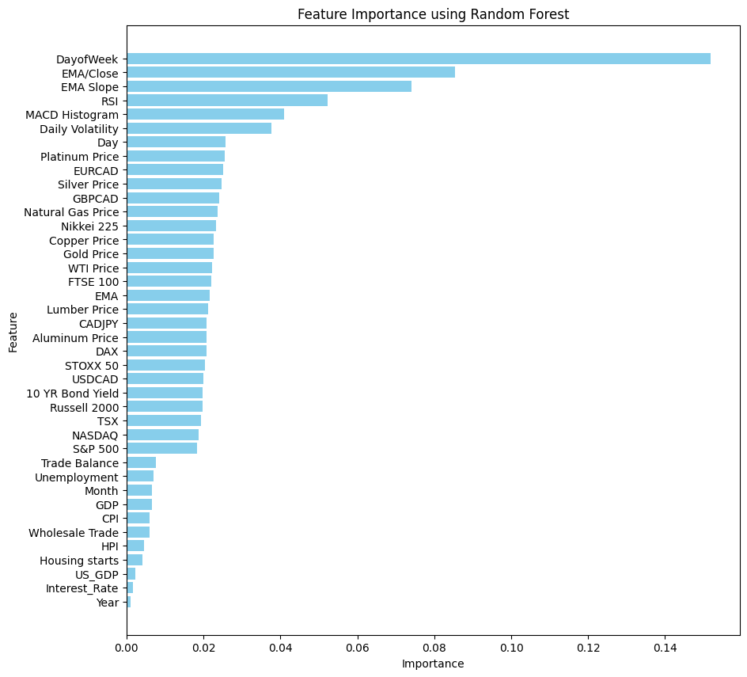

# Data Science Lighthouse Labs Final Project 

Created by: Ken Wall

### Data Science Final Project - Stock Price Prediction

To determine if the TSX index price will go up/down the next day based on a wide range of financial and economic features.

## Project Goals

To apply supervised learning techniques to a real-world financial data set and use exploratory data analysis, dimensionality reduction and feature engineering to communicate the insights gained from the analysis. To gain insights from the data sets and communicate these insights to stakeholders using appropriate visualizations and metrics to make informed decisions based on the business questions asked.

## Process

### <u>Part 1: Obtaining the Dataset</u>

Obtaining the financial and economic information was not challenging but tedious, because every feature had to be obtained in its own CSV file and then combined later on in Python.

Information could be broken down into the following categories:

- Commodities
- Currencies
- Economic
- Indexes

The individual commodity, currency and index information could be found on Investing.com. The economic data was taken from Statistics Canada. The economic data was not in a usuable format so custom Python functions had to be created to format it properly. Categories were first combined and then merged into a preprocessed dataset to be used in the baseline and the iterations of model selection.

### <u>Part 2: Exploratory Data Analysis (EDA)</u>

**BASELINE** - Time and careful consideration was given to the selection of the original features, so no EDA was done for baseline. The preprocessed dataset was cross validated using TimeSeriesSplit and then sent for model selection. See model selection below for further details.

**DATE-TIME COMPONENTS** - No meaningful patterns or trends were identified when reviewing if the index prices were up/down in certain years, months, and days. The index increased slightly more on a daily basis than going down at an average of 52.4% of the time. The maximum month where the index went up was 82.6% of the time in 2019 and the minimum was 2017 September at 27%. During the Covid Pandemic the market actually performed better in 2019-2021 with the index increasing greater than 55% of the time. Monthly fluctions occured, but on average each year the results are 
similar across all 10 years.

**TIME-SERIES GRAPHING** - When reviewing the line graphs over the 10 year time horizon of all the features it can be seen that many of the features have the same pattern/trend. A sharp decrease during COVID and a steady rise after. It is likely that the correlation between these features is very high, which will be confirmed in the next test.

**ITERATION 8 - CORRELATION** - After running the correlation matrix and heatmap, there are 11 features that have a correlation of greater than 0.9 with each other. Highly correlated features can lead to model problems due to multicolinearity and redundant information. As part of the iterative process, iteration 8 will remove the features with correlation greater than 0.9 and see how the model performs.

Other than logistical regression all other models performed worse once correlated features were removed. The best performing models are tree based models and correlated features do not inherently pose a problem for Decision Trees. Therefore I will leave the correlated features in for the first phase of model selection.

### <u>Part 3: Model Selection</u>

I chose an iterative approach to model selection and ran the dataset through the following models during each iteration to determine which had the best results:

- Logistic Regression
- Random Forest Classifier
- Support Vector Machines
- k-Nearest Neighbors (k-NN)
- XGBoost
- Neural Networks (MLP)

The table below outlines the changes made during each iteration and the model that had the best F1 Score. I chose the model with the highest F1 score to balance both precision (how many of the predicted positives are actually true positives) and recall (how many of the actual positives were correctly predicted).

 <table>
  <tr>
    <th>Version</th>
    <th>Iteration Changes</th>
    <th>Best Model</th>
    <th>F1 Score</th>
    <th>Accuracy</th>
  </tr>
  <tr>
    <td>Baseline</td>
    <td>Baseline</td>
    <td>Random Forest</td>
    <td>0.48</td>
    <td>0.63</td>
  </tr>
   <tr>
    <td>Version 1</td>
    <td>Baseline + EMA</td>
    <td>k-Nearest Neighbors</td>
    <td>0.58</td>
    <td>0.54</td>
  </tr>
   <tr>
    <td>Version 2</td>
    <td>Baseline + EMA + EMA Slope</td>
    <td>Neural Networks (MLP)</td>
    <td>0.56</td>
    <td>0.60</td>
  </tr>
   <tr>
    <td>Version 3</td>
    <td>Baseline + EMA + EMA Slope + EMA/Close</td>
    <td>k-Nearest Neighbors</td>
    <td>0.57</td>
    <td>0.64</td>
  </tr>
   <tr>
    <td>Version 4</td>
    <td>Baseline + EMA + EMA Slope + EMA/Close + EMA Divergence</td>
    <td>k-Nearest Neighbors</td>
    <td>0.60</td>
    <td>0.67</td>
  </tr>
   <tr>
    <td>Version 5</td>
    <td>Baseline + EMA + EMA Slope + EMA Divergence</td>
    <td>k-Nearest Neighbors</td>
    <td>0.58</td>
    <td>0.66</td>
  </tr>
   <tr>
    <td>Version 6</td>
    <td>Baseline + RSI</td>
    <td>k-Nearest Neighbors</td>
    <td>0.53</td>
    <td>0.62</td>
  </tr>
  <tr>
    <td>Version 7</td>
    <td>Baseline + Volatility</td>
    <td>Random Forest</td>
    <td>0.61</td>
    <td>0.61</td>
  </tr>
  <tr>
    <td>Version 8</td>
    <td>Baseline - Correlation</td>
    <td>XGBoost</td>
    <td>0.63</td>
    <td>0.60</td>
  </tr>
  <tr>
    <td>Version 9</td>
    <td>Baseline + MACD</td>
    <td>k-Nearest Neighbors</td>
    <td>0.52</td>
    <td>0.57</td>
  </tr>
  <tr>
    <td>Version 10</td>
    <td>Baseline + EMA + EMA Slope + EMA/Close + RSI</td>
    <td>XGBoost</td>
    <td>0.59</td>
    <td>0.70</td>
  </tr>
  <tr>
    <td>Version 11</td>
    <td>Baseline + EMA + EMA Slope + EMA/Close + Volatility</td>
    <td>Neural Networks (MLP)</td>
    <td>0.58</td>
    <td>0.66</td>
  </tr>
  <tr>
    <td>Version 12</td>
    <td>Baseline + EMA + EMA Slope + EMA/Close + MACD</td>
    <td>Logistic Regression</td>
    <td>0.63</td>
    <td>0.56</td>
  </tr>
  <tr>
    <td>Version 13</td>
    <td>Baseline + All EMA Features + RSI + MACD + Volatility</td>
    <td>XGBoost</td>
    <td>0.69</td>
    <td>0.74</td>
  </tr>
</table> 

After several versions of trial and error for features engineered for time based features (exponential moving average EMA), price transformations (volatility) and technical indicators (relative strength index RSI and moving average convergence divergence MACD) I moved to model driven feature elimination using recursive feature elimination (RFE) and Random Forest Importance to see if I can improve the model above the current benchmark of 0.69 F1 Score set in the Version 13 XGBoost Model. I have included all features initially to test this, baseline + all EMA features, RSI, MACD and volatility.

#### Recursive Feature Elimination
XGBoost was the most successful model for the 13 iterations noted above, so I stuck with it for RFE. The RFE class require number of features and I selected a range from 20 to 35 features given that the total number of features are 40. The F1 Score results are listed below. 20 features had the highest F1 Score at 0.687.

 <table>
  <tr>
    <th>Number of Features</th>
    <th>F1 Score</th>
  </tr>
  <tr>
    <th>20</th>
    <th>0.687</th>
  </tr>
  <tr>
    <th>25</th>
    <th>0.682</th>
  </tr>
  <tr>
    <th>30</th>
    <th>0.664</th>
  </tr>
  <tr>
    <th>35</th>
    <th>0.683</th>
  </tr>
</table>

#### Feature Importance

I also wanted to rank the importance of the features using the random forest classifier, which can be seen in the image below. There are 11 features (Trade balance to Year) that have minimal importance to the model. I dropped those features and then ran the data set through all of the models again and XGBoost had an F1 Score of 0.69 and an Accuracy of 0.75, which is the highest achieved so far, but similar to the XGBoost RFE F1 Score result of 0.687 with 20 features noted above.

An F1 Score of 0.69 is now the current benchmark and hyper parameter tuning is the next step to see if I can improve the F1 Score of the model further.

### <u>Part 4: Tuning and Pipelining</u>

Using the XGBClassifier I used GridSearchCV to determine the best paramaters and F1 Score, which improved to 0.7.

<table>
<tr><th>Best parameters found</th><tr>
<tr>
  <th>colsample_bytree</th>
  <th>1.0</th>
</tr>
<tr>
  <th>learning_rate</th>
  <th>0.01</th>
</tr>
<tr>
  <th>max_depth</th>
  <th>3</th>
</tr>
<tr>
  <th>min_child_weight</th>
  <th>5</th>
</tr>
<tr>
  <th>n_estimators</th>
  <th>200</th>
</tr>
<tr>
  <th>subsample</th>
  <th>1.0</th>
</tr>
</table>

## Results

## Challenges

## Future Goals